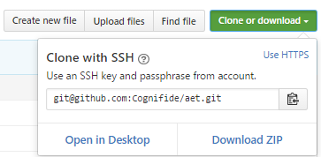

# Automated Exploratory Testing Workshop

  

## AET setup

#### 1. Please make sure that you have following software on your local machine (versions are very important):
   * [VirtualBox 5.0.26](https://www.virtualbox.org/wiki/Download_Old_Builds_5_0)
   * [Vagrant 1.8.4](https://www.vagrantup.com/downloads.html)
   * [ChefDK 0.17.17](https://downloads.chef.io/chef-dk/)
   * [Maven](https://maven.apache.org/download.cgi) (at least version 3.0.4)
   * [JDK 7 or 8](http://www.oracle.com/technetwork/java/javase/downloads/jdk7-downloads-1880260.html)
   * [Chrome browser](https://www.google.com/chrome/browser/desktop/)

TODO - how to check?

#### 2. Download AET Vagrant
Please navigate to [AET GitHub Repository](https://github.com/Cognifide/aet) and download or clone it using Git.

   * to download repo, simply click `Download ZIP` and unpack to your workspace directory,
   * to clone repository use your favourite Git client with repository address `https://github.com/Cognifide/aet.git` (or `git@github.com:Cognifide/aet.git` if you have GitHub account).

#### 3. Start AET Vagrant machine
Please navigate to your local AET repository to `vagrant` directory.
Open command prompt as an administrator and execute the following commands:

   * `vagrant plugin install vagrant-omnibus`
   * `vagrant plugin install vagrant-berkshelf`
   * `vagrant plugin install vagrant-hostmanager`

Run `berks install` and then `vagrant up` to start virtual machine. This process may take a few minutes.

#### 4. Check your machine
Enter [http://aet-vagrant:8181/system/console](http://aet-vagrant:8181/system/console) to check setup status after vagrant finished AET setup.

Console credentials are: 

   * username `karaf`, 
   * password `karaf`.

You should see the information `Bundle information: 251 bundles in total - all 251 bundles active`.

TODO: Hello world suite

This means you are ready to start your first AET tests.

## Running tests
There are 3 simple exercises that will quickly introduce you to the AET World. 
Order of performing exercises is not important, however we suggest starting with `exercise 1`.
Before running each exercise suite check out `explained` version of suite which contains comments with suite details.

You will find each exercise description inside its directory.

You will also find in this repository `pom-template.xml` and `suite-template.xml` that may be useful in the future to setup your own tests.

Directory `exercise-page` contains sources of a page that is used in the workshop. You may simply run it using [Apache Server](https://httpd.apache.org/download.cgi).